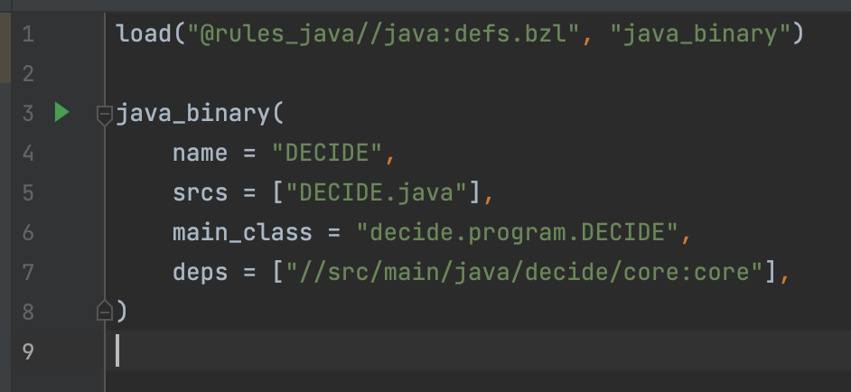

# DECIDE

DECIDE is a program that calculates from a set of input values whether to launch an anti-ballistic interceptor missile.

- [DECIDE](#decide)
  - [Summary](#summary)
  - [Run a prebuilt version](#run-a-prebuilt-version)
  - [Build](#build)
    - [Run the testsuite](#run-the-testsuite)
    - [Configure for development with IntelliJ (recommended)](#configure-for-development-with-intellij-recommended)
      - [About the java version](#about-the-java-version)
      - [IntelliJ IDEA for students](#intellij-idea-for-students)
      - [Bazel](#bazel)
      - [Importing Bazel Project](#importing-bazel-project)
      - [Add the main configuration](#add-the-main-configuration)
      - [Add the test Configuration](#add-the-test-configuration)
  - [Contribute](#contribute)
    - [Development workflow](#development-workflow)
    - [Statement Of Contributions](#statement-of-contributions)

Welcome to the first assignment in the course Software Engineering Fundamentals (DD2480). We will get you up to speed with what this assignment is about and what we have done.

We also explain how to build, run and debug the program on your own computer and run the test suite.

## Summary

DECIDE implements the Launch Interceptor Program, which is described in the requirement specification laid out by Knight and Leveson and adapted by Regehr and Monperrus.

This is achieved in part by calculating 15 different Launch Interceptor Conditions, according to the specification. For further details, refer to the specification. 

## Run a prebuilt version

All the versions of the `DECIDE` software is listed on the [releases page](https://github.com/Fundamentals-KTH-CSC-2022-P3/DECIDE/releases). The pre-built binaries can be downloaded from there.

Once downloaded, extract the archive

```bash
tar xvf DECIDE.tar.gz
```

To execute `DECIDE`, run

```bash
java --jar DECIDE.jar
```

## Build

To build `DECIDE` locally, you will need a local java development environment, and Bazel installed. The easiest way to install is the following.

On **MacOS:**

```bash
brew install bazelisk
```

On **Linux** or **Windows** use a prebuilt binary from the [Bazelisk website](https://github.com/bazelbuild/bazelisk/releases).

The first step is to clone the Git repo (assumes appropriate access):

```bash
git clone git@github.com:Fundamentals-KTH-CSC-2022-P3/DECIDE.git
cd DECIDE
```

Then the following command will build `DECIDE`:

```bash
bazel build //src/main/java/decide/program:DECIDE

# it can now be executed using
./bazel-bin/src/main/java/decide/program/DECIDE
```

You can also build and run `DECIDE` in one step:

```bash
bazel run //src/main/java/decide/program:DECIDE
```

### Run the test suite

You can run the default test suite with the following command

```bash
bazel test --color=yes --test_output=all -- //src/test/java/decide:testsuite
```

### Configure for development with IntelliJ (recommended)

This section describes how to configure the project for development in IntelliJ.

This assumes the following setup:

- Java 17
- IntelliJ IDEA
- Bazel
- Bazel For IntelliJ Plugin

#### About the java version

We'd recommend using the OpenJDK version of Java 17, though it should still work independently of JVM implementation.

#### IntelliJ IDEA for students

This project is created and coded with IntelliJ IDEA Ultimate. You can follow the link here for the [license for the IDEA](https://www.jetbrains.com/community/education/#students), and then install it through any package manager of your choice. Use your license to verify your copy.

The community edition of IntelliJ IDEA should work as well, but it isn't tested.

#### Bazel

Install Bazel through a package manager, and you're ready to go.

After cloning this repository, open the folder as a project in IntelliJ. Go to:

__Preferences -> Plugins__

and search for Bazel. Install the plugin Bazel by Google, and when prompted to restart your IDEA do so.

#### Importing Bazel Project

Go to `File -> Import Bazel Project...` and choose the DECIDE folder as the Workspace.

When prompted to import project view, choose to build from BUILD file, and choose the file `DECIDE/BUILD`. Finish the import. This will start up the Bazel Console, where syncing is underway.

When this finishes, you should be able to see the Bazel logo in the upper right corner.

#### Add the main configuration

Navigate to the file `src/main/java/decide/program/BUILD`. Clicking the green play button in the left sidebar will allow you to press `Run Bazel ...`. This will automatically add the proper configuration for you.



#### Add the test Configuration

Similarly to adding the main configuration, the testsuite is added by navigating to the file `src/test/java/decide/BUILD` and clicking the green play button in the left sidebar.


## Contribute

### Development workflow

Contributions should follow the following procedure

1. open an issue (if one doesn't already exist) that clearly describes what the feature/bug is
2. open a feature branch from `main` with the following syntax `issue-[ISSUE NUMBER]/slug-of-the-issue-title`
3. open a PR for merging the feature branch into main
4. only merge after at least one approval and all unit tests pass

### Statement Of Contributions

How the work load was separated between the group members, and who
did what can be seen in the list below.

It should be noted that this is a rough estimate of who was the main contributor to the different tasks.
Certain tasks were pair programmed, and others were solved after group discussions regarding design and implementation.
Furthermore, everybody has participated in code reviews of each other's code.

- Ludwig Kristoffersson:
  - Setup build and testing environment
  - Add CI workflows
  - LIC 13
  - Documentation in tests
  - Code for running the actual program that should output "YES" or "NO"
- Arvid Siberov:
  - LIC 0
  - LIC 4
  - LIC 8
  - LIC 9
  - LIC 12
  - Verify parameter values
- Katrina Liang:
  - LIC 5
  - LIC 6
  - Create the FUV
- Marcus Alevärn:
  - LIC 2
  - LIC 3
  - LIC 7
  - LIC 11
  - LIC 14
  - Create the PUM
- Samuel Philipson:
  - Setup build and testing environment.
  - Code for checking if 3 points are on a circle
  - LIC 1
  - LIC 10
